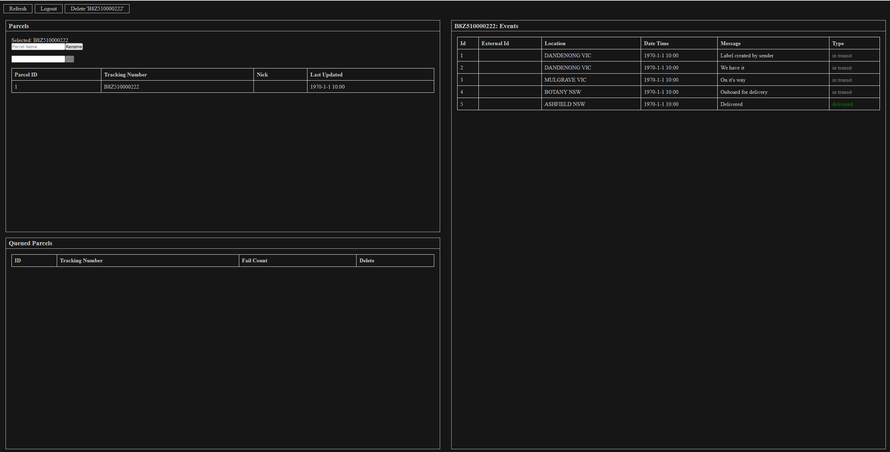

# AusPohzt 

API, Front End, and Notification Clients for tracking Australia Post and other parcels

Postgresql database using custom built ORM for Typescript entity mapping. 

# CI/CD  
A GitHub Action pipeline is configured to build, test, and deploy the application.  
DB Migrations are tested before releasing the application. 

# DB Migrations   
DB Migrations are handled by the `db-migrate` npm package.   
Migrations should be run 
- during development docker-compose startup, before API starts

Steps to run them   
1. `db-migrate db:create auspohzt`
2. `db-migrate up`  

Running DB Migrations requires the PG_ environment variables to be set.

## How to run in Docker
Run the application under docker 
1. Run `docker compose build`
2. Run `docker compose up -d`

## How to run 

1. Run `npm install` in the root directory
2. Setup postgresql database using `backend/database` scripts
3. Run `npm run build`
4. Configure `.env` file from `test.env`
5. Run `npm run back:server` in a new terminal to start the API
6. Run `npm run front:site` in a new terminal to server front end files
7. Run `npm run back:runner` periodically to sync tracking data from remote systems

## Screenshots

Parcel tracking UI showing delivery events for delivered package

## TODO 
General todo list. Some far fetched things like multi-user support, multiple package providers, etc
- [ ] Tracking 
    - [ ] Sync Tracking Data from UI
    - [x] Add Tracking ID
    - [x] Remove Tracking ID 
    - [x] Set nickname for Tracking ID 
    - [ ] Update Database when status changes
        - [x] Fix duplicate events not clearing properly
        - [x] Mark parcels as disabled after 3 runner errors
        - [x] Mark parcels as disabled when status is COMPLETE
        - [x] Runner does not check disabled parcels
        - [ ] Support marking package as delivered from UI
    - [ ] Handle dates correctly
        - [ ] Support 64 bit integers for dates, or
        - [ ] Migrate to postgres datetime date types
- [ ] User Management
    - [x] Authentication
    - [ ] Add User
    - [ ] Remove User
    - [ ] Authorization for runner, with signed tokens
    - [ ] User owns parcel
- [ ] System
    - [ ] Setup daemon scripts
        - [ ] node systemctl script
        - [ ] node macos service script
        - [ ] cronjob example for notifications
    - [x] Configure Docker
    - [ ] Setup multiple workers
    - [ ] Default nginx config for workers
- [ ] Notifications
    - [x] Barebones notification script
    - [ ] custom icon for notification (in MacOS only ?)
    - [ ] last events written to DB linked by mac address. 
    - [x] don't send notifications for disabled parcels
    - [x] include package location in update message
- [ ] Misc
    - [ ] Convert semi-JavaDocs to JSDocs 
    - [ ] Setup Github Actions
- [ ] Refactor
    - [x] pirate to support passing results through map() and mapMany()
    - [x] typing of entityDecorator.getEntityPrototype
    - [x] DRY dao code
    - [x] pirate.map() accepts row arg as array instead of single instance, see dao.find() comment
    - [x] controller code should use async/await instead of promise callbacks
    - [ ] use proper go fmt methods for logging ( unnecessary \n everywhere )
    - [x] parcel dao should be rewritten, needs to support most parcel methods returning a list
- [ ] Documentation
    - [x] Simple package.json/tsconfig setup
    - [x] Detail webpack config
